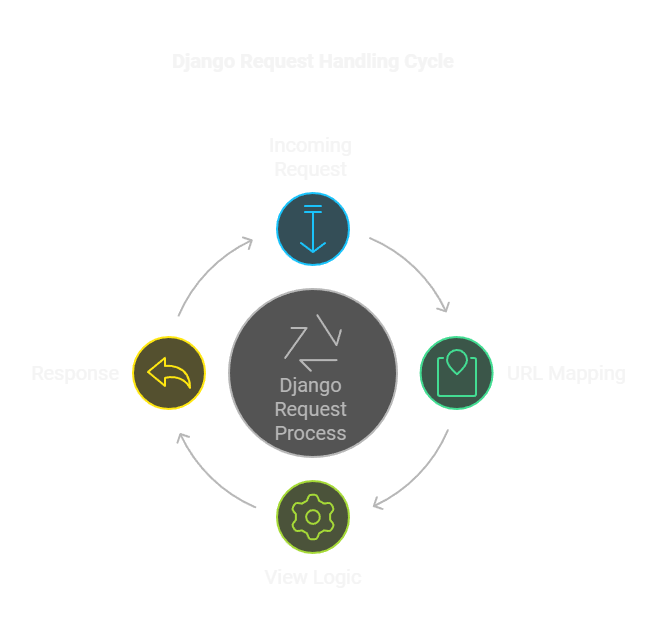

<div align="center">


</div>

## Introduction

Alr, so this project is basically me experimenting with Django and JWT-based authentication. It's not a super polished product (like i said it's a side project), but it helped me learn a bunch about REST tokens, user signups, and all that good stuff. Also why "N E B U L A"? its cause I like giving my projects cool name :P.

**Why/Backstory?**  
– I wanted to try out JWT with Django. It's fun messing around with token-based auth. Also, this project has some inconsistencies and vulnerabilities (be mindful!). Another reason? Curiosity and practice!

## Main Functionalities

1. **Login/Signup**  
   Handles user registration and authentication routes.
2. **JWT Support**  
   Implemented JWT tokens via `rest_framework_simplejwt`.
3. **Basic Pages**  
   There are some templates for login, signup, password reset, etc.

## Function and Files Overview

- **manage.py**: The main Django script for migrations, running the dev server, etc.
- **django_auth/settings.py**: Contains Django config, including JWT settings (token lifetime stuff).
- **authentication/views.py**: All the main auth logic: sign in, sign out, user activation, and password resets.
- **authentication/urls.py**: Just the route definitions.
- **templates/**: Contains HTML templates for login, signup, activation page, etc.
- **static/js & static/scss**: Some front-end styling and scripts (like jQuery, SCSS files).

## The Django Expressway

1. **Incoming Request**  
   The client's browser sends an HTTP request to our Django app.

2. **URL Mapping**  
   Django looks at `urls.py` (both the root `urls.py` and included app `urls.py`) to see which view function (or class-based view) should handle the request.

3. **View Logic**  
   The selected view does the heavy lifting—grabbing data from the database, handling forms, or doing any other logic you need.

4. **Response**  
   The view then returns an HTTP response (HTML, JSON, etc.) back to the user’s browser, completing the cycle.

And following is a nice little diagram to help visualize and understand more clearly...

<div align="center">



</div>

## How to Run/Use

1. **Clone the repo** (like i said, not 100% done, so watch out):

```
   git clone https://github.com/yourusername/django-jwt-auth.git
   cd django-jwt-auth
```

2. **Set up a virtual env** (just recommended):

```
   python -m venv venv
   venv\Scripts\activate
```

3. **Install requirements**:

```
   pip install -r requirements.txt
```

4. **Run server**:

```
   python manage.py runserver
```

5. **Open** a browser at http://127.0.0.1:8000/auth/login to check out the app.

## Next Steps and Todo

– Maybe thoroughly fix any vulnerabilities  
– Tweak JWT config further  
– Try out additional endpoints, user profile stuff, or role-based auth  
– Possibly add more tests, etc.

Kappaaa, that should be it. I might/might not expand this code base later on. For now, enjoy!
